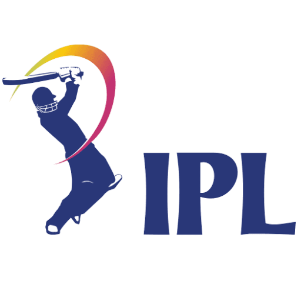

<a name="readme-top"></a>

[![Contributors][contributors-shield]][contributors-url]
[![Forks][forks-shield]][forks-url]
[![Stargazers][stars-shield]][stars-url]
[![Issues][issues-shield]][issues-url]
[![MIT License][license-shield]][license-url]
[![LinkedIn][linkedin-shield]][linkedin-url]


<!-- PROJECT LOGO -->
<br />
<div align="center">
  <a href="https://github.com/prayashdash1729/IPL_win_prediction">
    
  </a>

  <h3 align="center">IPL-Win-Predictor</h3>

  <p align="center">
    A <a href="https://ipl-win-predictor-dl6r.onrender.com/">Dashboard</a> to see win predictions of IPL matches
    <br />
    <a href="https://github.com/prayashdash1729/IPL_win_prediction"><strong>Explore the docs »</strong></a>
    <br />
    <br />
    <a href="https://ipl-win-predictor-dl6r.onrender.com/">View Dashboard</a>
    ·
    <a href="https://github.com/prayashdash1729/IPL_win_prediction/issues">Report Bug</a>
    ·
    <a href="https://github.com/prayashdash1729/IPL_win_prediction/issues">Request Feature</a>
  </p>
</div>


<!-- TABLE OF CONTENTS -->
<details>
  <summary>Table of Contents</summary>
  <ol>
    <li>
      <a href="#about-the-project">About The Project</a>
      <ul>
        <li><a href="#built-with">Built With</a></li>
      </ul>
    </li>
    <li>
      <a href="#getting-started">Getting Started</a>
      <ul>
        <li><a href="#installation">Installation</a></li>
      </ul>
    </li>
    <li><a href="#usage">Usage</a></li>
    <li><a href="#contributing">Contributing</a></li>
    <li><a href="#license">License</a></li>
    <li><a href="#contact">Contact</a></li>
  </ol>
</details>


<!-- ABOUT THE PROJECT -->
## About The Project

[![Product Name Screen Shot][product-screenshot]](https://ipl-win-predictor-dl6r.onrender.com/)

In India, the passion for cricket and the IPL craze among millions of fans is unparalleled, making it one of the most significant cultural events in the country.

I built this project during the IPL 2023 season. While enjoying any IPL match, we constantly think of what are the chances that the team you cheer for will win the match. We also boast about how intead if some other teams would have been on the other side, we would have already won the match by now.

The dashboard contains two options-
* <b>Live Match prediction-</b> Here you can get win prediction for Live ongoing IPL matches.
* <b>Custom Match prediction-</b> Here you can get win predictions for custom match senariors.

Of course, the predictions will not always be 100% percent correct. But its fun nonetheless. I'll be adding the live match feature shortly. You may also suggest changes by forking this repo and creating a pull request or opening an issue.

<p align="right">(<a href="#readme-top">back to top</a>)</p>


### Built With

This section should list any major frameworks/libraries used to bootstrap your project. Leave any add-ons/plugins for the acknowledgements section. Here are a few examples.

* [![Python][Python]][Python-url]
* [![Pandas][Pandas]][Pandas-url]
* [![Scikit-Learn][Scikit-Learn]][Scikit-Learn-url]
* [![Streamlit][Streamlit]][Streamlit-url]

<p align="right">(<a href="#readme-top">back to top</a>)</p>


<!-- GETTING STARTED -->
## Getting Started

This is an example of how you may give instructions on setting up your project locally.
To get a local copy up and running follow these simple example steps.


### Installation to run this project locally

_Below is an example of how you can instruct your audience on installing and setting up your app. This template doesn't rely on any external dependencies or services._

1. Fork this repo- [fork](https://github.com/prayashdash1729/IPL_win_prediction/fork)
2. Clone the forked repo
    ```sh
   git clone https://github.com/your_username_/forked-reo-name.git
   ```
3. Go the preoject directory
    ```sh
    cd path/to/cloned/repo/
    ```
4. Install requirements
    ```sh
    pip install -r requirements.txt
    ```
5. Run the dashboard
   ```sh
   streamlit run app.py
   ```

<!-- <p align="right">(<a href="#readme-top">back to top</a>)</p> -->


<!-- USAGE EXAMPLES -->
## Usage

_Navigate the Dashboard through the sidebar. Rest is self explanatory._

<p align="right">(<a href="#readme-top">back to top</a>)</p>

<!-- CONTRIBUTING -->
## Contributing

Contributions are what make the open source community such an amazing place to learn, inspire, and create. Any contributions you make are **greatly appreciated**.

If you have a suggestion that would make this better, please fork the repo and create a pull request. You can also simply open an issue with the tag "enhancement".
Don't forget to give the project a star! Thanks again!

1. Fork the Project
2. Create your Feature Branch (`git checkout -b feature/AmazingFeature`)
3. Commit your Changes (`git commit -m 'Add some AmazingFeature'`)
4. Push to the Branch (`git push origin feature/AmazingFeature`)
5. Open a Pull Request

<p align="right">(<a href="#readme-top">back to top</a>)</p>


<!-- LICENSE -->
## License

Distributed under the MIT License. See `LICENSE.txt` for more information.

<p align="right">(<a href="#readme-top">back to top</a>)</p>


<!-- CONTACT -->
## Contact

Prayash Dash - [@prayashdash_](https://www.instagram.com/prayashdash_/) - prayashdash2003@gmail.com

Project Link: [https://github.com/prayashdash1729/IPL_win_prediction](https://github.com/prayashdash1729/IPL_win_prediction)

<p align="right">(<a href="#readme-top">back to top</a>)</p>


<!-- MARKDOWN LINKS & IMAGES -->
<!-- https://www.markdownguide.org/basic-syntax/#reference-style-links -->
[contributors-shield]: https://img.shields.io/github/contributors/prayashdash1729/IPL_win_prediction.svg?style=for-the-badge
[contributors-url]: https://github.com/prayashdash1729/IPL_win_prediction/graphs/contributors
[forks-shield]: https://img.shields.io/github/forks/prayashdash1729/IPL_win_prediction.svg?style=for-the-badge
[forks-url]: https://github.com/prayashdash1729/IPL_win_prediction/network/members
[stars-shield]: https://img.shields.io/github/stars/prayashdash1729/IPL_win_prediction.svg?style=for-the-badge
[stars-url]: https://github.com/prayashdash1729/IPL_win_prediction/stargazers
[issues-shield]: https://img.shields.io/github/issues/prayashdash1729/IPL_win_prediction.svg?style=for-the-badge
[issues-url]: https://github.com/prayashdash1729/IPL_win_prediction/issues
[license-shield]: https://img.shields.io/github/license/prayashdash1729/IPL_win_prediction.svg?style=for-the-badge
[license-url]: https://github.com/prayashdash1729/IPL_win_prediction/blob/main/LICENSE
[linkedin-shield]: https://img.shields.io/badge/-LinkedIn-black.svg?style=for-the-badge&logo=linkedin&colorB=555
[linkedin-url]: https://linkedin.com/in/prayashdash
[product-screenshot]: images/ipl_dashboard.png
[Python]: https://img.shields.io/badge/python-3670A0?style=for-the-badge&logo=python&logoColor=ffdd54
[Python-url]: https://www.python.org/
[Pandas]: https://img.shields.io/badge/pandas-%23150458.svg?style=for-the-badge&logo=pandas&logoColor=white
[Pandas-url]: https://pandas.pydata.org/
[Scikit-Learn]: https://img.shields.io/badge/scikit--learn-%23F7931E.svg?style=for-the-badge&logo=scikit-learn&logoColor=white
[Scikit-Learn-url]: https://scikit-learn.org/stable/
[Streamlit]: https://img.shields.io/badge/streamlit-%23121011.svg?style=for-the-badge&logo=streamlit&logoColor=white
[Streamlit-url]: https://streamlit.io/